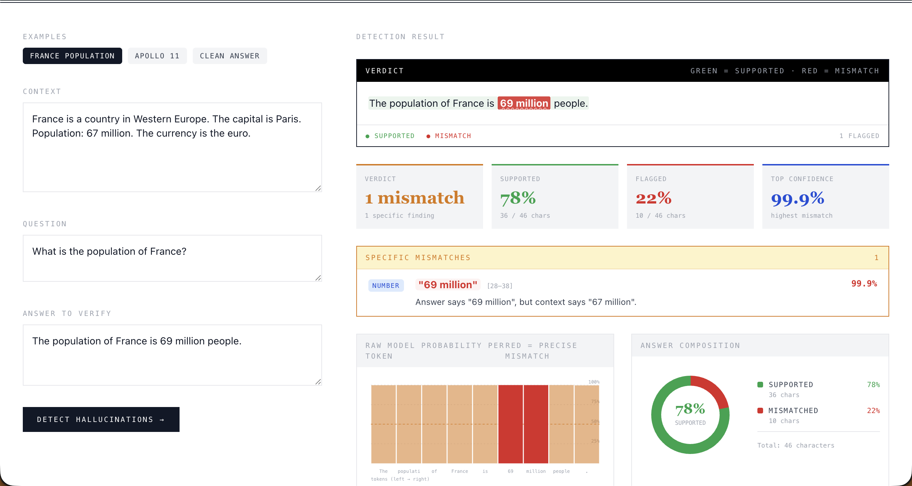
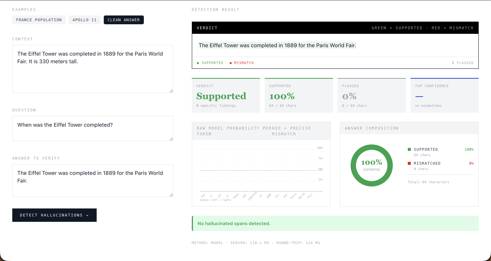

# Hallucination Detection & Mitigation Tool

LLM-powered tool that detects unsupported text spans in generated answers,
scores per-span confidence, and surfaces the supporting context — wrapped in
a clean UI. Built for an AI / Machine Learning class project.

## Screenshots

**Mismatch detected** — model + numerical diff catch `"69 million"` and explain it against the context's `"67 million"`. Stats show 1 specific finding, 78% supported, 22% flagged, top confidence 99.9%.



**Clean answer** — Eiffel Tower example. Verdict: Supported · 0 specific findings · 100% of characters supported · donut shows fully green.



```
ai_hallucination/
├── presentation/   ← React/Vite slide deck (15 slides, already complete)
├── backend/        ← FastAPI + lettucedetect (ModernBERT) detection service
├── frontend/       ← Vite + React + Tailwind live demo UI
└── docs/           ← screenshots
```

## Architecture

```
 ┌────────────┐    POST /detect    ┌──────────────────┐    transformer    ┌────────────────┐
 │  Frontend  │ ─────────────────▶ │  FastAPI server  │ ─────────────────▶│ lettucedetect  │
 │ (React UI) │ ◀──── spans ─────  │  (CORS enabled)  │ ◀── token labels  │ ModernBERT enc.│
 └────────────┘                    └────────┬─────────┘                   └────────────────┘
                                            │ on model load failure
                                            ▼
                                   heuristic fallback
                                  (number / proper-noun
                                   overlap with context)
```

The detector returns:

```json
{
  "spans": [{"start": 28, "end": 38, "text": "69 million", "confidence": 0.99, "label": "hallucinated"}],
  "overall_score": 0.74,
  "method": "model"
}
```

## Quick start

### 1. Backend

```bash
cd backend
python -m venv venv
source venv/bin/activate
pip install -r requirements.txt
uvicorn app:app --reload --port 8000
```

First run downloads ~150 MB of model weights from HuggingFace. If the install
or download fails, the server still starts — it just runs in **heuristic
mode** (rule-based fallback so the UI works for development).

Visit http://localhost:8000/docs for interactive API docs.

### 2. Frontend (in a second terminal)

```bash
cd frontend
npm install
npm run dev
```

Open http://localhost:5173.

### 3. Presentation (optional)

```bash
cd presentation
npm install
npm run dev
```

## Design notes

- **Token-level over sentence-level.** The presentation argues the case;
  the implementation reflects it. Output spans carry exact character offsets
  so the UI can highlight the precise unsupported phrase.
- **Graceful fallback.** ML installs are heavy. The detector has a pure-Python
  heuristic path that flags numbers + proper-noun phrases not present in
  context. Useful for demos without GPUs.
- **Same design language across all three apps.** Newspaper-style serif
  headings, mono labels, blue/green/red semantic accents — consistent with
  the slide deck.

## Educational scope

This is intentionally minimal. The presentation describes additional pieces
(self-consistency sampling over N generations, closed-loop retrieval) that
require generating answers as well as classifying them. The implementation
focuses on the **detection** stage end-to-end — the most useful and
self-contained piece for learning.
